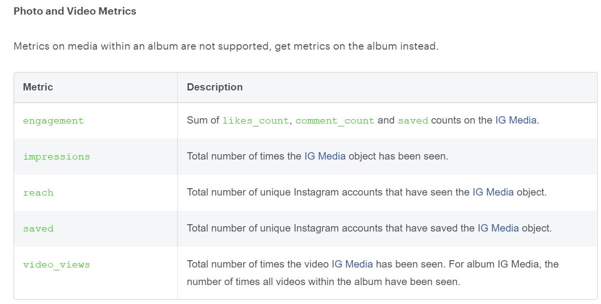

## Guidelines to get data and insight from Instagram

### Prerequisite
* Instagram Professional account
* Facebook Page Account
### Configuration
* Instagram
    * connect to fackbook page
* Facebook
    * [Create an app](https://developers.facebook.com/apps) --> add product "Facebook Login" -> save default settings
    * [Graph API Explorer](https://developers.facebook.com/tools/explorer/)
        * Get Access Token
        * Get User ID, Page ID, Instagram ID and Media object
            * <code>GET /me/accounts</code>
              
            * <code>GET /{page-id}?fields=instagram_business_account</code>
              
            * <code>GET /{ig-user-id}/media</code>
              
###Instagram Insights

* impression(#seen)
* reach accounts(#account seen)
* saved
* video_views
  
<iframe width="600" height="373.5" src="https://app.powerbi.com/view?r=eyJrIjoiNzMwNDFmNGUtNjM4Yi00NTIxLWE1YTQtOTU0OTZhMDRlZjg3IiwidCI6ImNiOTAzNDgyLWU1MGYtNDlkNC1hMDlhLTFiYTIzMjc1MTFhNiJ9" frameborder="0" allowFullScreen="true"></iframe>

#### Reference
https://developers.facebook.com/docs/instagram-api/getting-started
https://developers.facebook.com/docs/instagram-api/reference/ig-media/insights/
https://developers.facebook.com/tools/explorer/
